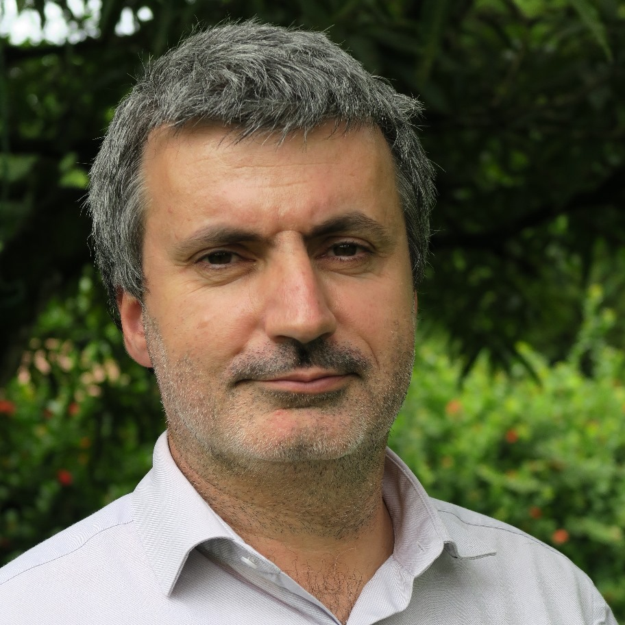

```{css, echo=FALSE}
.aside {
  padding-top: 0;
}

.aside > p:first-of-type {
  margin-top: 0;
}

.pagedjs_page {
  --pagedjs-margin-bottom: 0.2in;
}
``` 

```{r setup, include=FALSE}
# Installation of packages if necessary
InstallPackages <- function(Packages) {
  InstallPackage <- function(Package) {
    if (!Package %in% installed.packages()[, 1]) {
      install.packages(Package, repos = "https://cran.rstudio.com/")
    }
  }
  invisible(sapply(Packages, InstallPackage))
}
# Add necessary packages here
Packages <- c("tidyverse", "scholar")
# Install them
InstallPackages(Packages)
# ggplot style
library("tidyverse")
theme_set(theme_bw())
theme_update(
  panel.background = element_rect(fill = "transparent", colour = NA),
  plot.background = element_rect(fill = "transparent", colour = NA),
  text = element_text(size = 20)
)
knitr::opts_chunk$set(dev.args = list(bg = "transparent"))
# Set language to format the dates correctly
Sys.setlocale("LC_TIME", "en_GB") 
# Random seed
set.seed(973)
```

Aside
================================================================================





Contact Info {#contact}
--------------------------------------------------------------------------------

- <i class="fa fa-envelope"></i> eric.marcon@agroparistech.fr
- <i class="fa fa-globe"></i> [Home Page](https://ericmarcon.github.io/fr/)
- <i class="fa fa-github"></i> [Github](https://github.com/ericmarcon)
- <i class="fa fa-google"></i> [Google Scholar](https://scholar.google.com/citations?user=4iLBmbUAAAAJ)
- <i class="fa fa-phone"></i> +33 7 87 05 70 55


Skills {#skills}
--------------------------------------------------------------------------------

- Experienced in management, research, teaching, forestry and IT.

- Skilled in ecology, economics, forest science, statistics, data analysis and modelling.

- Highly skilled in R.


Language {#language}
--------------------------------------------------------------------------------

- French: mother tongue (C2)
- English: fluent (C1)
- Italian: advanced (B2)
- Portuguese: advanced (B1)
- Spanish: operational (A2)


Disclaimer {#disclaimer}
--------------------------------------------------------------------------------

Last updated on `r format(Sys.Date(), format="%B %d %Y")`.


Main
================================================================================

Eric Marcon {#title}
--------------------------------------------------------------------------------

### Currently lecturer and researcher with AgroParisTech, PhD.

I am a researcher in Tropical Ecology with [Amap lab](http://amap.cirad.fr/en/), a professor at [AgroParisTech](http://www.agroparistech.fr/) and a coordinator of the [BioGET](https://biologie-ecologie.com/master-b2e/parcours/bioget/) course of the Biodiversity, Ecology and Evolution master's degree at AgroParisTech and Montpellier University.

I'm the director of training with [Ceba Excellence Laboratory](https://www.labex-ceba.fr/) (Centre d'Etudes de la Biodiversité Amazonienne),a member of the [Scientific Council](https://www.ofb.gouv.fr/le-conseil-scientifique) of the French Office for Biodiversity and a member of the [domain committee](https://www.ecologie.gouv.fr/evaluation-des-activites-dexpertise-scientifique-et-technique-comites-domaine) *Sustainable management of Natural Resources - Biodiversity* of the French Ministry of Ecology.

```{r age, include=FALSE}
library("lubridate")
my_birth <- ymd("1967-10-14")
today <- Sys.Date()
my_age <- trunc(time_length(interval(my_birth, today), "years"))
```

I am `r my_age` years old and I live in Montpellier, France.


Professional Experience {data-icon=suitcase}
--------------------------------------------------------------------------------

### Lecturer-researcher in charge of a master's programme

AgroParisTech, Amap lab.

Montpellier, France

Présent - 2020

### Campus director with AgroParisTech

AgroParisTech

Kourou, French Guiana

2020 - 2006

### Educational engineer

Ecole Nationale du Génie Rural, des Eaux et des Forêts (post-graduate, environment engineering and public administration school, now merged with AgroParisTech)

Kourou, French Guiana

2006 - 2002

### Head of IT at Cemagref General Management

Research Institute for Agricultural and Environmental Engineering (now merged with Inrae: National Research Institute for Agriculture, Food and Environment)

Antony, France

2002 - 1999

### Head of IT at Engref General Management

Ecole Nationale du Génie Rural, des Eaux et des Forêts

Paris, France

1997 - 1995

### Forest engineer

Head of Division with the National Forest Office

Charleville-Mézières, France

1995 - 1991


Education {data-icon=graduation-cap data-concise=true}
--------------------------------------------------------------------------------

### University of French Guiana

Habilitation à Diriger des Recherches (French qualification to supervise research) in Ecology

Kourou, French Guiana

2016

[Thesis](https://theses.hal.science/tel-01502970/): Measuring biodiversity and spatial structures (in French)


### AgroParisTech

PhD in Ecology

Paris, France

2010

[Thesis](https://theses.hal.science/pastel-00540327/): Spatial statistics with applications to ecology and economics (in French)


### Ecole Nationale du Génie Rural, des Eaux et des Forêts

Post-Graduate Engineering School of Public Administration

Paris, France

1999


### University of Paris, Panthéon Sorbonne

MSc in International Economic

Paris, france

1999

Thesis: The international timber trade (in French)


### Ecole Nationale des Ingénieurs des Travaux des Eaux et Forêts

Graduate Engineering School of Forestry

Nogent sur Vernisson, France

1990


Research Experience {data-icon=laptop}
--------------------------------------------------------------------------------

### Researcher in Tropical Ecology

Associate researcher at AMAP lab.

Montpellier, France

Present - 2020

::: aside
<i class="fa fa-flask"></i> [Amap Lab](https://amap.cirad.fr/)
:::


### Head of Research Unit Ecology of Guiana Forests

AgroParisTech

Kourou, French Guiana

2020 - 2006

- Deputy director from 2006 to 2009 and director from 2010.

::: aside
<i class="fa fa-flask"></i> [EcoFoG Lab](https://www.ecofog.gf/)
:::


Teaching Experience {data-icon=chalkboard-teacher}
--------------------------------------------------------------------------------

### Biodiversity, Ecology and Evolution, BioGET master's programme

AgroParisTech and University of Montpellier

Montpellier, France

Present - 2020

I coordinate the Plant Biodiversity and Management of Tropical Ecosystems (BioGET) programme, which is co-organised by the University of Montpellier and AgroParisTech.

::: aside
<i class="fa fa-university"></i> [Master BioGET](https://biologie-ecologie.com/master-bee/bioget/)
:::

### AgroParisTech final year

AgroParisTech

Montpellier, France

Present - 2022

I teach tropical forest ecology, epistemology in ecology and statistics with R to final-year, graduate engineering students in the Environmental Management of Tropical Ecosystems and Forests major.

::: aside
<i class="fa fa-university"></i> [Geeft MSc](https://www.genv-agroparistech.fr/en/postgraduate-programs/international-msc-geeft)
:::


### Biodiversity, Ecology and Evolution, EFT master's programme

AgroParisTech and University of French Guiana

Kourou, French Guiana

Present - 2010

I teach biodiversity measurement and species abundance distributions to Master 2 students in the Ecology of Tropical Forests programme. This course receives students from the Erasmus Mundus Tropimundo Master's, coordinated by the Free University of Brussels.

::: aside
<i class="fa fa-university"></i> [EFT MSc](https://www.ecofog.gf/spip.php?rubrique47)

<i class="fa fa-university"></i> [Tropimundo MSc](https://tropimundo.eu/)
:::


### Erasmus Mundus Global Forestry master's programme

University of Copenhagen

Copenhagen, Denmark

Present - 2022

I teach tropical forest ecology and sustainable forest management in the Erasmus Mundus Global Forestry Master 1 programme, coordinated by the University of Copenhagen.

::: aside
<i class="fa fa-university"></i> [Global Forestry MSc](https://globalforestry.eu/)
:::


Publications {data-icon=file}
--------------------------------------------------------------------------------

### Measurement of Biodiversity

I wrote a series of papers to contribute to the development of methods to measure diversity rigorously, including an R package and a book.

N/A

Present - 2012

- Marcon, E., Mirabel, A., Molino, J.-F., Sabatier, D. (2024). Estimation of the number of tree species in French Guiana by extrapolation of permanent plots richness. *Journal of Tropical Ecology*, [40, e11](https://doi.org/10.1017/S0266467424000099).
- Grabchak, M., Marcon, E., Lang, G., & Zhang, Z. (2017). The generalized Simpson’s entropy is a measure of biodiversity. *Plos One*, [12, e0173305](https://doi.org/10.1371/journal.pone.0173305).
- Buckland, S. T., Yuan, Y., & Marcon, E. (2017). Measuring temporal trends in biodiversity. *AStA Advances in Statistical Analysis*, [101, 461-474](https://doi.org/10.1007/s10182-017-0308-1).
- Pavoine, S., Marcon, E., & Ricotta, C. (2016). ‘Equivalent numbers’ for species, phylogenetic or functional diversity in a nested hierarchy of multiple scales. *Methods in Ecology and Evolution*, [7(10), 1152-1163](https://doi.org/10.1111/2041-210X.12591).
- Marcon, E., & Hérault, B. (2015). Decomposing phylodiversity. *Methods in Ecology and Evolution*, [6, 333-339](https://doi.org/10.1111/2041-210X.12323).
- Marcon, E., & Hérault, B. (2015). *entropart*, an R package to measure and partition diversity. *Journal of Statistical Software*, [67, 1-26](https://doi.org/10.18637/jss.v067.i08).
- Marcon, E., Scotti, I., Hérault, B., Rossi, V., & Lang, G. (2014). Generalization of the partitioning of Shannon diversity. *Plos One*, [9, e90289](https://doi.org/10.1371/journal.pone.0090289).
- Marcon, E., Hérault, B., Baraloto, C., & Lang, G. (2012). The decomposition of Shannon’s entropy and a confidence interval for beta diversity. *Oikos*, [121, 516-522](https://doi.org/10.1111/j.1600-0706.2011.19267.x).

::: aside
```{r citations, echo=FALSE, message=FALSE, warning=FALSE}
library("scholar")
author_id <- "4iLBmbUAAAAJ" # Eric Marcon
# Personal handle to avoid filtering by Google
site <- getOption("scholar_site")
author_url <- paste0(site, "/citations?user=", author_id)
author_handle <- httr::GET(author_url)
options(
  scholar_call_home = FALSE, 
  scholar_handle = author_handle
)
# Figure
author_id %>% 
  get_citation_history %>% 
  ggplot(aes(year, cites)) +
  geom_segment(aes(xend = year, yend = 0), linewidth = 1, color = 'darkgrey') +
  geom_point(size = 3, color = 'firebrick') +
  labs(
    title = "Citations (Google Scholar)",
    caption = paste("Indice h :", author_id %>% get_profile %>% pluck("h_index")),
    x = "Year",
    y = "Citations"
  )
```
:::


### Characterization of spatial patterns

I co-authored with Florence Puech a series of papers in the field of spatial microeconometrics. An R package is available.

N/A

Present - 2003 

- Marcon, E., & Puech, F. (2023). Mapping distributions in non-homogeneous space with distance-based methods. *Journal of Spatial Econometrics*, [4, 13](https://doi.org/10.1007/s43071-023-00042-1).
- Lang, G., Marcon, E., & Puech, F. (2020). Distance-based measures of spatial concentration: Introducing a relative density function. *The Annals of Regional Science*, [64, 243-265](https://doi.org/10.1007/s00168-019-00946-7).
- Marcon, E. (2019). Mesure de la biodiversité et de la structuration spatiale de l’activité économique par l’entropie. *Revue Économique*, [70(3), 305-326](https://doi.org/10.3917/reco.703.0305). [English translation](https://ericmarcon.github.io/Revue-Economique-2019/).
- Marcon, E., & Puech, F. (2017). A typology of distance-based measures of spatial concentration. *Regional Science and Urban Economics*, [62, 56-67](https://doi.org/10.1016/j.regsciurbeco.2016.10.004).
- Marcon, E., Traissac, S., Puech, F., & Lang, G. (2015). Tools to characterize point patterns: *dbmss* for R. *Journal of Statistical Software*, [67, 1-15](https://doi.org/10.18637/jss.v067.c03).
- Marcon, E., Traissac, S., & Lang, G. (2013). A statistical test for Ripley’s function rejection of poisson null hypothesis. *ISRN Ecology*, [Article ID 753475](https://doi.org/10.1155/2013/753475).
- Lang, G., & Marcon, E. (2013). Testing randomness of spatial point patterns with the Ripley statistic. *ESAIM: Probability and Statistics*, [17, 767-788](https://doi.org/10.1051/ps/2012027).
- Marcon, E., Puech, F., & Traissac, S. (2012). Characterizing the relative spatial structure of point patterns. *International Journal of Ecology*, [Article ID 619281](https://doi.org/10.1155/2012/619281).
- Marcon, E., & Puech, F. (2010). Measures of the geographic concentration of industries: Improving distance-based methods. *Journal of Economic Geography*, [10, 745-762](https://doi.org/10.1093/jeg/lbp056).
- Marcon, E., & Puech, F. (2003). Evaluating the geographic concentration of industries using distance-based methods. *Journal of Economic Geography*, [3, 409-428](https://doi.org/10.1093/jeg/lbg016).


### Tropical Forest Ecology

I contributed to several research programmes in French Guiana.

Kourou, Guyane française

2020 - 2007

- Schmitt, S. *et al.* (2020). Topography consistently drives intra- and inter-specific leaf trait variation within tree species complexes in a Neotropical forest. *Oikos*, [129, 1521-1530](https://doi.org/10.1111/oik.07488).
- Richard-Hansen  *et al.* (2015). Landscape patterns influence communities of medium- to large-bodied vertebrate in undisturbed terra firme forests of French Guiana. *Journal of Tropical Ecology*, [31, 423-436](https://doi.org/10.1017/S0266467415000255).
- Coste, S. *et al.* (2010). Assessing foliar chlorophyll contents with the SPAD-502 chlorophyll meter: A calibration test with thirteen tree species of tropical rainforest in French Guiana. *Annals of Forest Science*, [67, 607](https://doi.org/10.1051/forest/2010020).
- Baraloto, C., Marcon, E., Morneau, F., Pavoine, S., & Roggy, J.-C. (2010). Integrating functional diversity into tropical forest plantation designs to study ecosystem processes. *Annals of Forest Science*, [67, 303](https://doi.org/10.1051/forest/2009110).
- Blanc, L. *et al.*  (2009). Dynamics of aboveground carbon stocks in a selectively logged tropical forest. *Ecological Applications*, [19, 1397-1404](https://doi.org/10.1890/08-1572.1).
- Bonal, D. *et al.* (2007). The successional status of tropical rainforest tree species is associated with differences in leaf carbon isotope discrimination and functional traits. *Annals of Forest Science*, [64, 169-176](https://doi.org/10.1051/forest:2006101).


### Ecology

I contributed to synthesis and large-scale studies papers in ecology.

N/A

Present - 2019

- Hordijk, I. *et al.* (2025). Effect of climate on traits of dominant and rare tree species in the world’s forests. *Nature Communications*, [16, 4773](https://doi.org/10.1038/s41467-025-59754-7).
- Mo, L. *et al.* (2024). The global distribution and drivers of wood density and their impact on forest carbon stocks. *Nature Ecology & Evolution*, [8, 2195-2212](https://doi.org/10.1038/s41559-024-02564-9).
- Hordijk, I. *et al.* (2024). Dominance and rarity in tree communities across the globe: Patterns, predictors and threats. *Global Ecology and Biogeography* [33, e13889](https://doi.org/10.1111/geb.13889).
- Zou, Y. *et al.* (2024). Positive Feedbacks and Alternative Stable States in Forest Leaf Types. *Nature Communications* [15, 4658](https://doi.org/10.1038/s41467-024-48676-5).
- Bouchard, E. *et al.*  (2024). Global patterns and environmental drivers of forest functional composition. *Global Ecology and Biogeography*, [33, 303-324](https://doi.org/10.1111/geb.13790).
- Mo, L. *et al.* (2023). Integrated global assessment of the natural forest carbon potential. *Nature*, [624, 92-101](https://doi.org/10.1038/s41586-023-06723-z).
- Ma, H.  *et al.* (2023). The global biogeography of tree leaf form and habit. *Nature Plants*, [9, 1795-1809](https://doi.org/10.1038/s41477-023-01543-5).
- Hordijk, I. *et al.* (2023). Evenness mediates the global relationship between forest productivity and richness. *Journal of Ecology*, [111, 1308-1326](https://doi.org/10.1111/1365-2745.14098).
- Delavaux, C. S. *et al.* (2023). Native diversity buffers against severity of non-native tree invasions. *Nature*, [621, 773-781](https://doi.org/10.1038/s41586-023-06440-7).
- Liang, J. *et al.* (2022). Co-limitation towards lower latitudes shapes global forest diversity gradients. *Nature Ecology & Evolution*, [6, 1423-1437](https://doi.org/10.1038/s41559-022-01831-x).
- Kattge, J. *et al.* (2020). TRY plant trait database – enhanced coverage and open access. *Global Change Biology*, [26, 119-188](https://doi.org/10.1111/gcb.14904).
- Steidinger, B. S. *et al.* (2019). Climatic controls of decomposition drive the global biogeography of forest tree symbioses. *Nature*, [569, 404-408](https://doi.org/10.1038/s41586-019-1128-0).


### Student supervision

I contributed to the publications of students I supervised.

N/A

Present - 2007

- Nemetschek, D., Fortunel, C., Marcon, E., Auer, J., Badouard, V., Baraloto, C., Boisseaux, M., Bonal, D., Coste, S., Dardevette, E., Heuret, P., Hietz, P., Levionnois, S., Maréchaux, I., Stahl, C., Vleminckx, J., Wanek, W., Ziegler, C., Derroire, G. (2024). Love Thy Neighbour? Tropical Tree Growth and Its Response to Climate Anomalies Is Mediated by Neighbourhood Hierarchy and Dissimilarity in Carbon and Water Related Traits. *Ecology Letters*, [28, e70028](https://doi.org/10.1111/ele.70028)
- Goulpeau, A., Hedde, M., Ganault, P., Lapied, E., Maggia, M.-E., Marcon, E., Decaëns, T. (2025) Dissecting Earthworm Diversity in Tropical Rainforests. *Ecography*, [e07697](https://doi.org/10.1111/ecog.07697)
- Kaçamak, B., Réjou-Méchain, M., Rowe, N., Rossi, V., Barbier, N., Bazan, S., Forni, E., Guibal, D., Harris, D.J., Loubota Panzou, G.J., Loumeto, J., Marcon, E., Pinho, B.X., Zombo, I., Gourlet‐Fleury, S. (2025). Local Forest Structure and Host Specificity Influence Liana Community Composition in a Moist Central African Forest. *Ecology and Evolution*, [15, e71075](https://doi.org/10.1002/ece3.71075)
- Nemetschek, D., Derroire, G., Marcon, E., Aubry-Kientz, M., Auer, J., Badouard, V., Baraloto, C., Bauman, D., Le Blaye, Q., Boisseaux, M., Bonal, D., Coste, S., Dardevet, E., Heuret, P., Hietz, P., Levionnois, S., Maréchaux, I., McMahon, S. M., Stahl, C., Vleminckx, J., Wanek, W., Ziegler, C., & Fortunel, C. (2024). Climate anomalies and neighbourhood crowding interact in shaping tree growth in old‐growth and selectively logged tropical forests. *Journal of Ecology*,[112, 590-612](https://doi.org/10.1111/1365-2745.14256)
- Penel, B., Freycon, V., Marcon, E., Rossi, V., Cornu, G., Bénédet, F., Forni, E., & Gourlet-Fleury, S. (2022). Macrotermes termite mounds influence the spatial pattern of tree species in two African rainforest sites, in northern Congo. But were they really forests in the past? *Journal of Tropical Ecology*, [38, 267-274](https://doi.org/10.1017/S0266467422000165).
- Mirabel, A., Marcon, E., & Hérault, B. (2021). 30 Years of postdisturbance recruitment in a Neotropical forest. *Ecology and Evolution*, [11, 14448-14458](https://doi.org/10.1002/ece3.7634).
- Mirabel, A., Hérault, B., & Marcon, E. (2020). Diverging taxonomic and functional trajectories following disturbance in a Neotropical forest. *Science of The Total Environment*, [720, 137397](https://doi.org/10.1016/J.SCITOTENV.2020.137397).
- Ollivier, M., Baraloto, C., & Marcon, E. (2007). A trait database for Guianan rain forest trees permits intra- and inter-specific contrasts. *Annals of Forest Science*, [64, 781-786](https://doi.org/10.1051/forest:2007058).


### Books

I wrote two scientific books which are available in open access on HAL and are kept up to date on GitHub.

N/A

Present - 2015

- Marcon, E. (2021). Working R. UMR Amap. Montpellier, France. https://doi.org/10.5281/zenodo.5778902.
- Marcon, E. (2018). Mesures de la Biodiversité. UMR EcoFoG Kourou, France. https://agroparistech.hal.science/cel-01205813v5.

::: aside
<i class="fa-solid fa-book-open-reader"></i> [Working with R](https://ericmarcon.github.io/WorkingWithR/)

<i class="fa-solid fa-book-open-reader"></i> [Travailler avec R](https://ericmarcon.github.io/travailleR/) (in French)

<i class="fa-solid fa-book-open-reader"></i> [Mesures de la Biodiversité](https://ericmarcon.github.io/MesuresBioDiv2/) (in French)
:::


### Reviewing

I've been a reviewer for many scientific journals.

N/A

Present - 2003

::: concise
- Acta Biotheoretica
- Agricultural and Forest Meteorology
- Annals of Forest Science
- AStA Advances in Statistical Analysis
- Biodiversity and Conservation
- Bois et Forêts des Tropiques
- Cybergeo 
- Diversity
- Diversity and Distributions
- Ecography
- Ecological Indicators
- Ecological Informatics
- Ecology and Evolution
- Économie et Prévision
- Économie et Statistique
- Empirical Economics
- Entropy
- Environmental and Ecological Statistics
- Environmetrics
- Forest Ecosystems
- Forestry Ideas
- Forests
- Geographical Analysis
- Hacettepe Journal of Mathematics and Statistics
- Indian Journal of Science & Technology
- Journal of Classification
- Journal of Economic Geography
- Journal of Environmental Management
- Journal of Geographical Systems
- Journal of the Royal Statistical Society
- Journal of Theoretical Biology
- Journal of Vegetation Science
- Land
- Mathematics
- Methods in Ecology and Evolution
- Microorganisms
- Nitrogen
- Molecular Ecology Resources
- Oecologia
- One Earth
- Papers in Regional Science
- PeerJ
- Planning Practice and Research
- Plants
- Plos ONE
- Regional Science and Urban Economics
- Regional Studies
- Science of the Total Environment
- Spatial Economic Analysis
- Stochastic Environmental Research and Risk Assessment
- Sustainability
- The R Journal
- Theoretical Ecology
- Theory in Biosciences
- Urban Geography
- Urban Studies
- Web Ecology
:::


Software development {data-icon=laptop-code}
--------------------------------------------------------------------------------

### entropart

entropart is an R package that provides functions to calculate alpha, beta and gamma diversity of communities, including phylogenetic and functional diversity. Estimation-bias corrections are available.

N/A

2015

::: aside
<i class="fa-brands fa-github"></i> [Package entropart](https://ericmarcon.github.io/entropart/)
:::


### dbmss

dbmss is an R package for simple computation of spatial statistic functions of distance to characterize the spatial structures of mapped objects, including classical ones (Ripley’s $K$ and others) and more recent ones used by spatial economists (Duranton and Overman’s $K_d$, Marcon and Puech’s $M$). It relies on spatstat for some core calculation.

N/A

2015

::: aside
<i class="fa-brands fa-github"></i> [Package dbmss](https://ericmarcon.github.io/dbmss/)
:::

### memoiR

Templates to publish well-formatted and reproducible documents both in HTML and PDF formats.

N/A

2021

::: aside
<i class="fa-brands fa-github"></i> [Package memoiR](https://ericmarcon.github.io/memoiR/)
:::
