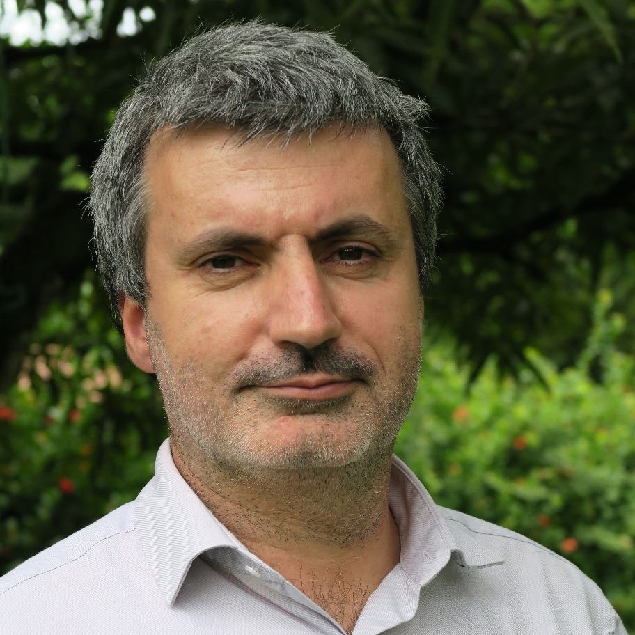

```{css, echo=FALSE}
.aside {
  padding-top: 0;
}

.aside > p:first-of-type {
  margin-top: 0;
}

.pagedjs_page {
  --pagedjs-margin-bottom: 0.2in;
}
``` 

```{r setup, include=FALSE}
# Installation of packages if necessary
InstallPackages <- function(Packages) {
  InstallPackage <- function(Package) {
    if (!Package %in% installed.packages()[, 1]) {
      install.packages(Package, repos="https://cran.rstudio.com/")
    }
  }
  invisible(sapply(Packages, InstallPackage))
}
# Add necessary packages here
Packages <- c("tidyverse", "scholar")
# Install them
InstallPackages(Packages)
# ggplot style
library("tidyverse")
theme_set(theme_bw())
theme_update(
  panel.background = element_rect(fill = "transparent", colour = NA),
  plot.background = element_rect(fill = "transparent", colour = NA),
  text = element_text(size=20)
)
knitr::opts_chunk$set(dev.args = list(bg = "transparent"))
# Set language to format the dates correctly
Sys.setlocale("LC_TIME", "fr_FR") 
# Random seed
set.seed(973)
```


Aside
================================================================================


 


Contact {#contact}
--------------------------------------------------------------------------------

- <i class="fa fa-envelope"></i> eric.marcon@agroparistech.fr
- <i class="fa fa-globe"></i> [Page personnelle](https://ericmarcon.github.io/fr/)
- <i class="fa fa-github"></i> [Github](https://github.com/ericmarcon)
- <i class="fa fa-google"></i> [Google Scholar](https://scholar.google.com/citations?user=4iLBmbUAAAAJ)
- <i class="fa fa-phone"></i> +33 7 87 05 70 55


Compétences {#skills}
--------------------------------------------------------------------------------

- Expérience en gestion et encadrement, en recherche, enseignement, gestion forestière et informatique.

- Compétences en écologie, économie, sciences forestières, statistiques, analyse de données, modélisation et développement logiciel.

- Maîtrise de R.


Langues {#skills}
--------------------------------------------------------------------------------

- Français langue maternelle (C2)
- Anglais courant (C1)
- Italien avancé (B2)
- Portugais avancé (B1)
- Espagnol fonctionnel (A2)


Disclaimer {#disclaimer}
--------------------------------------------------------------------------------

Mise à jour le `r format(Sys.Date(), format="%d %B %Y")`.


Main
================================================================================

Eric Marcon {#title}
--------------------------------------------------------------------------------

### Ingénieur Général des Ponts, des Eaux et des Forêts, Docteur en Écologie, Habilité à Diriger des Recherches

Je suis chercheur en écologie tropicale à l’[UMR Amap](http://amap.cirad.fr/en/), enseignant à [AgroParisTech](http://www.agroparistech.fr/) et coordinateur du parcours [BioGET](https://biologie-ecologie.com/master-b2e/parcours/bioget/) du master Biodiversité, Ecologie et Evolution (AgroParisTech et Université de Montpellier).

Je suis directeur de la formation du [Laboratoire d'Excellence Ceba](https://www.labex-ceba.fr/) (Centre d'Etudes de la Biodiversité Amazonienne) et membre du [Conseil Scientifique](https://www.ofb.gouv.fr/le-conseil-scientifique) de l’Office Français de la Biodiversité.

```{r, include=FALSE}
library("lubridate")
naiss <- ymd("1967-10-14")
evt <- Sys.Date()
my_age <- trunc(time_length(interval(naiss, evt), "years"))
```

J'ai `r my_age` ans et j'habite à Montpellier.


Experience Professionelle {data-icon=suitcase}
--------------------------------------------------------------------------------

### Enseignant-chercheur, responsable d'un parcours de master

AgroParisTech, UMR Amap.

Montpellier, France

Présent - 2020

### Directeur du campus de Kourou d’AgroParisTech

AgroParisTech

Kourou, Guyane française

2020 - 2006

### Ingénieur pédagogique

Ecole Nationale du Génie Rural, des Eaux et des Forêts

Kourou, Guyane française

2006 - 2002

### Responsable informatique de la direction générale du Cemagref

Institut de recherche pour l'ingénierie de l'agriculture et de l'environnement

Antony, France

2002 - 1999

### Responsable informatique du centre de Paris de l’Engref

Ecole Nationale du Génie Rural, des Eaux et des Forêts

Paris, France

1997 - 1995

### Ingénieur forestier

Chef de division à l'Office National des Forêts

Charleville-Mézières, France

1995 - 1991


Formation {data-icon=graduation-cap data-concise=true}
--------------------------------------------------------------------------------

### Université de Guyane

Habilitation à Diriger des Recherches

Kourou, Guyane française

2016

[Mémoire](https://theses.hal.science/tel-01502970/) : Mesurer la Biodiversité et la Structuration Spatiale

### AgroParisTech

Doctorat en écologie

Paris, France

2010

[Thèse](https://theses.hal.science/pastel-00540327/) : Statistiques spatiales avec applications à l’écologie et à l’économie

### Ecole Nationale du Génie Rural, des Eaux et des Forêts

Ingénieur du Génie Rural, des Eaux et des Forêts

Paris, France

1999

### Université Paris I, Panthéon Sorbonne

DEA en économie internationale

Paris, France

1999

Mémoire : Le commerce international du bois

### Ecole Nationale des Ingénieurs des Travaux des Eaux et Forêts

Ingénieur des Travaux des Eaux et Forêts

Nogent sur Vernisson, France

1990


Activité de Recherche {data-icon=laptop}
--------------------------------------------------------------------------------

### Chercheur en écologie tropicale 

Chercheur associé à l'UMR Amap.

Montpellier, France

Présent - 2020

::: aside
<i class="fa fa-flask"></i> [UMR Amap](https://amap.cirad.fr/)
:::


### Directeur de l’Unité Mixte de Recherche Ecologie des Forêts de Guyane

AgroParisTech

Kourou, Guyane française

2020 - 2006

- Directeur adjoint de 2006 à 2009 puis directeur à partir de 2010

::: aside
<i class="fa fa-flask"></i> [UMR EcoFoG](https://www.ecofog.gf/)
:::


Enseignement {data-icon=chalkboard-teacher}
--------------------------------------------------------------------------------

### Master Biodiversité, Ecologie et Evolution, parcours BioGET

AgroParisTech et Université de Montpellier

Montpellier, France

Présent - 2020

Je coordonne le parcours Biodiversité végétale et Gestion des Ecosystèmes Tropicaux (BioGET) co-organisé par l'Université de Montpellier et AgroParisTech.

::: aside
<i class="fa fa-university"></i> [Master BioGET](https://biologie-ecologie.com/master-bee/bioget/)
:::

### Dominante d'Approfondissement AgroParisTech

AgroParisTech

Montpellier, France

Présent - 2022

J'enseigne l'écologie forestière tropicale, l'épistémologie en écologie et les statistiques sous R aux élèves ingénieurs en dernière année, dans la dominante d'approfondissement Gestion Environnementale des Ecosystèmes Forestiers Tropicaux.

::: aside
<i class="fa fa-university"></i> [DA Geeft](https://www.genv-agroparistech.fr/fr/nos-formations/ingenieur-agroparistech-da-geeft)
:::


### Master Biodiversité, Ecologie et Evolution, parcours EFT

AgroParisTech et Université de Guyane

Kourou, Guyane française

Présent - 2010

J'enseigne la mesure de la biodiversité et les distributions d'abondances d'espèces aux étudiants de Master 2 du parcours Ecologie des Forêts Tropicales. Ce parcours reçoit des étudiants du Master Erasmus Mundus Tropimundo, coordonné par l'Université libre de Bruxelles.

::: aside
<i class="fa fa-university"></i> [Master EFT](https://www.ecofog.gf/spip.php?rubrique47)

<i class="fa fa-university"></i> [Master Tropimundo](https://tropimundo.eu/)
:::


### Master Erasmus Mundus Global Forestry

Université de Copenhague

Copenhague, Danemark

Présent - 2022

J'enseigne l'écologie forestière tropicale et la gestion forestière durable dans le Master 1 Erasmus Mundus Global Forestry, coordonné par l'Université de Copenhague.

::: aside
<i class="fa fa-university"></i> [Master Global Forestry](https://globalforestry.eu/)
:::


Publications {data-icon=file}
--------------------------------------------------------------------------------

### Mesure de la biodiversité

J'ai rédigé une série d'articles pour contribuer au développement de méthodes permettant de mesurer la diversité de manière rigoureuse, y compris un package pour R et un livre.

N/A

2024 - 2012

- Marcon, E., Mirabel, A., Molino, J.-F., Sabatier, D. (in press). Estimation of the number of tree species in French Guiana by extrapolation of permanent plots richness. *Journal of Tropical Ecology*. [Postprint](https://ericmarcon.github.io/JTE-22-105/).
- Grabchak, M., Marcon, E., Lang, G., & Zhang, Z. (2017). The generalized Simpson’s entropy is a measure of biodiversity. *Plos One*, [12, e0173305](https://doi.org/10.1371/journal.pone.0173305).
- Buckland, S. T., Yuan, Y., & Marcon, E. (2017). Measuring temporal trends in biodiversity. *AStA Advances in Statistical Analysis*, [101, 461–474](https://doi.org/10.1007/s10182-017-0308-1).
- Pavoine, S., Marcon, E., & Ricotta, C. (2016). ‘Equivalent numbers’ for species, phylogenetic or functional diversity in a nested hierarchy of multiple scales. *Methods in Ecology and Evolution*, [7(10), 1152–1163](https://doi.org/10.1111/2041-210X.12591).
- Marcon, E., & Hérault, B. (2015). Decomposing phylodiversity. *Methods in Ecology and Evolution*, [6, 333–339](https://doi.org/10.1111/2041-210X.12323).
- Marcon, E., & Hérault, B. (2015). *entropart*, an R package to measure and partition diversity. *Journal of Statistical Software*, [67, 1–26](https://doi.org/10.18637/jss.v067.i08).
- Marcon, E., Scotti, I., Hérault, B., Rossi, V., & Lang, G. (2014). Generalization of the partitioning of Shannon diversity. *Plos One*, [9, e90289](https://doi.org/10.1371/journal.pone.0090289).
- Marcon, E., Hérault, B., Baraloto, C., & Lang, G. (2012). The decomposition of Shannon’s entropy and a confidence interval for beta diversity. *Oikos*, [121, 516–522](https://doi.org/10.1111/j.1600-0706.2011.19267.x).

::: aside
```{r citations, echo=FALSE, message=FALSE, warning=FALSE}
library("scholar")
AuthorID <- "4iLBmbUAAAAJ" # Eric Marcon
AuthorID %>% 
  get_citation_history %>% 
  ggplot(aes(year, cites)) +
    geom_segment(aes(xend = year, yend = 0), linewidth = 1, color = 'darkgrey') +
    geom_point(size = 3, color = 'firebrick') +
    labs(
      title = "Citations (Google Scholar)",
      caption = paste("Indice h :", AuthorID %>% get_profile %>% pluck("h_index")),
      x = "Année",
      y = "Citations"
    )
```
:::


### Caractérisation des structures spatiales

J'ai co-écrit avec Florence Puech une série d'articles dans le domaine de la microéconométrie spatiale. Un package R est disponible.

N/A

2023 - 2003 

- Marcon, E., & Puech, F. (2023). Mapping distributions in non-homogeneous space with distance-based methods. *Journal of Spatial Econometrics*, [4, 13](https://doi.org/10.1007/s43071-023-00042-1).
- Lang, G., Marcon, E., & Puech, F. (2020). Distance-based measures of spatial concentration: Introducing a relative density function. *The Annals of Regional Science*, [64, 243–265](https://doi.org/10.1007/s00168-019-00946-7).
- Marcon, E. (2019). Mesure de la biodiversité et de la structuration spatiale de l’activité économique par l’entropie. *Revue Économique*, [70(3), 305–326](https://doi.org/10.3917/reco.703.0305). [English translation](https://ericmarcon.github.io/Revue-Economique-2019/).
- Marcon, E., & Puech, F. (2017). A typology of distance-based measures of spatial concentration. *Regional Science and Urban Economics*, [62, 56–67](https://doi.org/10.1016/j.regsciurbeco.2016.10.004).
- Marcon, E., Traissac, S., Puech, F., & Lang, G. (2015). Tools to characterize point patterns: *dbmss* for R. *Journal of Statistical Software*, [67, 1–15](https://doi.org/10.18637/jss.v067.c03).
- Marcon, E., Traissac, S., & Lang, G. (2013). A statistical test for Ripley’s function rejection of poisson null hypothesis. *ISRN Ecology*, [Article ID 753475](https://doi.org/10.1155/2013/753475).
- Lang, G., & Marcon, E. (2013). Testing randomness of spatial point patterns with the Ripley statistic. *ESAIM: Probability and Statistics*, [17, 767–788](https://doi.org/10.1051/ps/2012027).
- Marcon, E., Puech, F., & Traissac, S. (2012). Characterizing the relative spatial structure of point patterns. *International Journal of Ecology*, [Article ID 619281](https://doi.org/10.1155/2012/619281).
- Marcon, E., & Puech, F. (2010). Measures of the geographic concentration of industries: Improving distance-based methods. *Journal of Economic Geography*, [10, 745–762](https://doi.org/10.1093/jeg/lbp056).
- Marcon, E., & Puech, F. (2003). Evaluating the geographic concentration of industries using distance-based methods. *Journal of Economic Geography*, [3, 409–428](https://doi.org/10.1093/jeg/lbg016).


### Economie géographique

J'ai participé à plusieurs articles et chapitres d'ouvrage en français concernant l'application de ces méthodes.

N/A

2018 - 2005 

- Floch, J.-M., Marcon, E., & Puech, F. (2018). Les configurations de points. In V. Loonis & M.-P. (de) Bellefon (Eds.), *Manuel d’analyse spatiale* (pp. [73–114](https://www.insee.fr/fr/information/3635442)). Insee-Eurostat.
- Marcon, E., & Puech, F. (2015). Mesures de la concentration spatiale en espace continu: Théorie et applications. *Économie et Statistique*, [474](https://www.leseditionsdunet.com/livre/economie-et-statistique-ndeg474), 105–131.
- Marcon, E., & Puech, F. (2012). La mesure en économie internationale. In L. Abdelmalki, J.-P. Allegret, F. Puech, M. S. Jallab, & A. Silem (Eds.), *Développements récents en économie et finances internationales* (pp. [15–27](https://www.cairn.info/developpements-recents-en-economie-et-finances--9782200280536.htm)). Armand Colin.
- Marcon, E., Mucchielli, J.-L., & Puech, F. (2005). Concentration géographique de l’emploi industriel et dynamiques territoriales en France de 1993 à 2001. In E. M. Mouhoud (Ed.), *Localisation des activités et stratégies de l’Etat — Rapport du commissariat général du plan groupe Perroux* (pp. [99–109](https://www.vie-publique.fr/rapport/27802-la-localisation-des-activites-et-les-strategies-de-letat-contribution)). L’Action Municipale. 


### Écologie des forêts tropicales

J'ai contribué à plusieurs programmes de recherche en Guyane française.

Kourou, Guyane française

2020 - 2007

- Schmitt, S. *et al.* (2020). Topography consistently drives intra- and inter-specific leaf trait variation within tree species complexes in a Neotropical forest. *Oikos*, [129, 1521–1530](https://doi.org/10.1111/oik.07488).
- Richard-Hansen  *et al.* (2015). Landscape patterns influence communities of medium- to large-bodied vertebrate in undisturbed terra firme forests of French Guiana. *Journal of Tropical Ecology*, [31, 423–436](https://doi.org/10.1017/S0266467415000255).
- Coste, S. *et al.* (2010). Assessing foliar chlorophyll contents with the SPAD-502 chlorophyll meter: A calibration test with thirteen tree species of tropical rainforest in French Guiana. *Annals of Forest Science*, [67, 607](https://doi.org/10.1051/forest/2010020).
- Baraloto, C., Marcon, E., Morneau, F., Pavoine, S., & Roggy, J.-C. (2010). Integrating functional diversity into tropical forest plantation designs to study ecosystem processes. *Annals of Forest Science*, [67, 303](https://doi.org/10.1051/forest/2009110).
- Blanc, L. *et al.*  (2009). Dynamics of aboveground carbon stocks in a selectively logged tropical forest. *Ecological Applications*, [19, 1397–1404](https://doi.org/10.1890/08-1572.1).
- Bonal, D. *et al.* (2007). The successional status of tropical rainforest tree species is associated with differences in leaf carbon isotope discrimination and functional traits. *Annals of Forest Science*, [64, 169–176](https://doi.org/10.1051/forest:2006101).


### Ecologie

J'ai contribué à des documents de synthèse et à des études à grande échelle en écologie.

N/A

2024 - 2019

- Bouchard, E. *et al.*  (2024). Global patterns and environmental drivers of forest functional composition. *Global Ecology and Biogeography*, [33, 303-324](https://doi.org/10.1111/geb.13790).
- Mo, L. *et al.* (2023). Integrated global assessment of the natural forest carbon potential. *Nature*, [624, 92–101](https://doi.org/10.1038/s41586-023-06723-z).
- Ma, H.  *et al.* (2023). The global biogeography of tree leaf form and habit. *Nature Plants*, [9, 1795–1809](https://doi.org/10.1038/s41477-023-01543-5).
- Hordijk, I. *et al.* (2023). Evenness mediates the global relationship between forest productivity and richness. *Journal of Ecology*, [111, 1308–1326](https://doi.org/10.1111/1365-2745.14098).
- Delavaux, C. S. *et al.* (2023). Native diversity buffers against severity of non-native tree invasions. *Nature*, [621, 773–781](https://doi.org/10.1038/s41586-023-06440-7).
- Liang, J. *et al.* (2022). Co-limitation towards lower latitudes shapes global forest diversity gradients. *Nature Ecology & Evolution*, [6, 1423–1437](https://doi.org/10.1038/s41559-022-01831-x).
- Kattge, J. *et al.* (2020). TRY plant trait database – enhanced coverage and open access. *Global Change Biology*, [26, 119–188](https://doi.org/10.1111/gcb.14904).
- Steidinger, B. S. *et al.* (2019). Climatic controls of decomposition drive the global biogeography of forest tree symbioses. *Nature*, [569, 404–408](https://doi.org/10.1038/s41586-019-1128-0).


### Encadrement d'étudiants

J'ai contribué aux publications d'étudiants que j'ai encadrés.

N/A

Présent - 2007

- Nemetschek, D., Derroire, G., Marcon, E., Aubry-Kientz, M., Auer, J., Badouard, V., Baraloto, C., Bauman, D., Le Blaye, Q., Boisseaux, M., Bonal, D., Coste, S., Dardevet, E., Heuret, P., Hietz, P., Levionnois, S., Maréchaux, I., McMahon, S. M., Stahl, C., Vleminckx, J., Wanek, W., Ziegler, C., & Fortunel, C. (2024). Climate anomalies and neighbourhood crowding interact in shaping tree growth in old‐growth and selectively logged tropical forests. *Journal of Ecology*,[112, 590-612](https://doi.org/10.1111/1365-2745.14256)
- Penel, B., Freycon, V., Marcon, E., Rossi, V., Cornu, G., Bénédet, F., Forni, E., & Gourlet-Fleury, S. (2022). Macrotermes termite mounds influence the spatial pattern of tree species in two African rainforest sites, in northern Congo. But were they really forests in the past? *Journal of Tropical Ecology*, [38, 267–274](https://doi.org/10.1017/S0266467422000165).
- Mirabel, A., Marcon, E., & Hérault, B. (2021). 30 Years of postdisturbance recruitment in a Neotropical forest. *Ecology and Evolution*, [11, 14448–14458](https://doi.org/10.1002/ece3.7634).
- Mirabel, A., Hérault, B., & Marcon, E. (2020). Diverging taxonomic and functional trajectories following disturbance in a Neotropical forest. *Science of The Total Environment*, [720, 137397](https://doi.org/10.1016/J.SCITOTENV.2020.137397).
- Ollivier, M., Baraloto, C., & Marcon, E. (2007). A trait database for Guianan rain forest trees permits intra- and inter-specific contrasts. *Annals of Forest Science*, [64, 781–786](https://doi.org/10.1051/forest:2007058).


### Ouvrages

J'ai écrit deux livres scientifiques disponibles en accès libre sur HAL et maintenus à jour en permanence sur GitHub.

N/A

Présent - 2015

- Marcon, E. (2021). *Travailler avec R*. UMR Amap. Montpellier, France. https://doi.org/10.5281/zenodo.5778902.
- Marcon, E. (2018). *Mesures de la Biodiversité*. UMR EcoFoG Kourou, France. https://agroparistech.hal.science/cel-01205813v5.

::: aside
<i class="fa-solid fa-book-open-reader"></i> [Travailler avec R](https://ericmarcon.github.io/travailleR/)

<i class="fa-solid fa-book-open-reader"></i> [Working with R](https://ericmarcon.github.io/WorkingWithR/)

<i class="fa-solid fa-book-open-reader"></i> [Mesures de la Biodiversité](https://ericmarcon.github.io/MesuresBioDiv2/)
:::


### Révision d'articles

J'ai été rapporteur pour de nombreux journaux scientifiques.

N/A

Present - 2003

::: concise
- Acta Biotheoretica
- Annals of Forest Science
- AStA Advances in Statistical Analysis
- Biodiversity and Conservation
- Bois et Forêts des Tropiques
- Cybergeo 
- Diversity
- Ecography
- Ecological Indicators
- Ecology and Evolution
- Économie et Prévision
- Économie et Statistique
- Empirical Economics
- Entropy
- Environmental and Ecological Statistics
- Environmetrics
- Forest Ecosystems
- Forests
- Geographical Analysis
- Hacettepe Journal of Mathematics and Statistics
- Indian Journal of Science & Technology
- Journal of Classification
- Journal of Economic Geography
- Journal of Geographical Systems
- Journal of the Royal Statistical Society
- Journal of Theoretical Biology
- Journal of Vegetation Science
- Mathematics
- Methods in Ecology and Evolution
- Microorganisms
- Molecular Ecology Resources
- Nitrogen
- Oecologia
- Papers in Regional Science
- PeerJ
- Planning Practice and Research
- Plants
- Plos ONE
- Regional Science and Urban Economics
- Regional Studies
- Science of the Total Environment
- Spatial Economic Analysis
- Stochastic Environmental Research and Risk Assessment
- The R Journal
- Theoretical Ecology
- Theory in Biosciences
- Urban Geography
- Urban Studies
- Web Ecology
:::


Développement logiciel {data-icon=laptop-code}
--------------------------------------------------------------------------------

### entropart

entropart est un package R qui fournit des fonctions pour calculer la diversité $\alpha$, $\beta$ et $\gamma$ des communautés, y compris la diversité phylogénétique et fonctionnelle.
Des corrections de biais d'estimation sont disponibles.

N/A

2015

::: aside
<i class="fa-brands fa-github"></i> [Package entropart](https://ericmarcon.github.io/entropart/)
:::


### dbmss

dbmss est un package R pour le calcul simple des statistiques spatiales non paramétriques, y compris les fonctions classiques ($K$ de Ripley et autres) et les fonctions plus récentes utilisées par les économistes spatiaux ($K_d$ de Duranton et Overman, $M$ de Marcon et Puech).

N/A

2015

::: aside
<i class="fa-brands fa-github"></i> [Package dbmss](https://ericmarcon.github.io/dbmss/)
:::

### memoiR

Package R pour la publication de documents reproductibles bien formatés.

N/A

2021

::: aside
<i class="fa-brands fa-github"></i> [Package memoiR](https://ericmarcon.github.io/memoiR/)
:::
